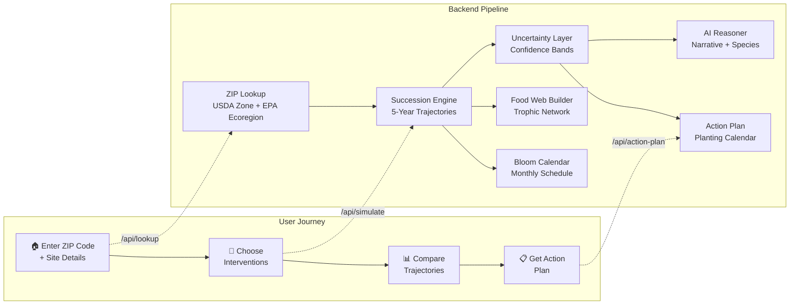
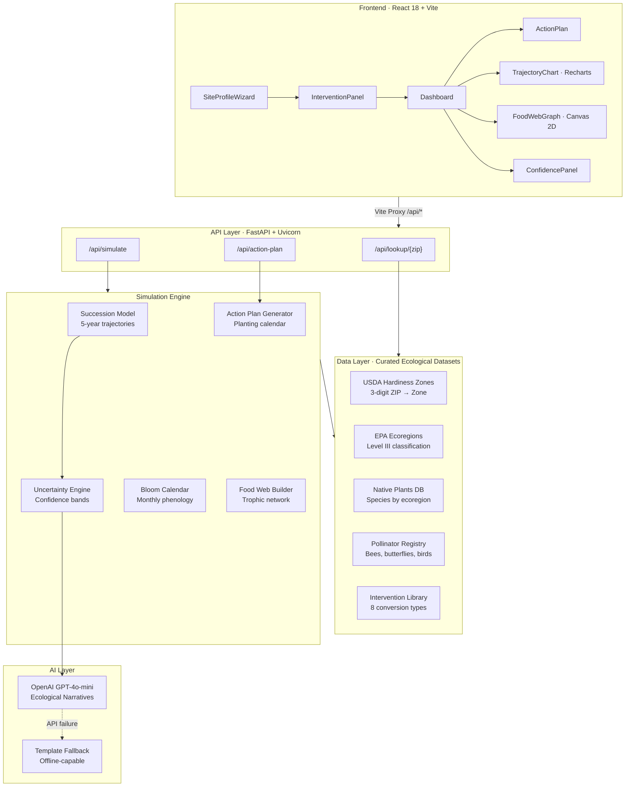
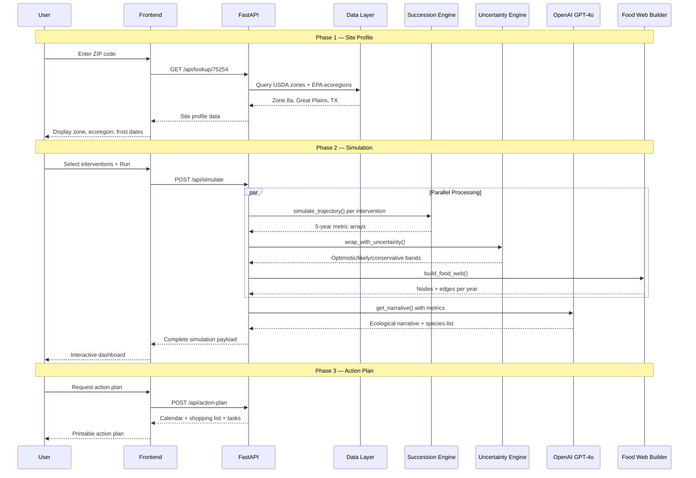

# 🌿 REWILD — Ecological Scenario Engine for Micro-Habitats

[](https://www.python.org/downloads/)
[](https://react.dev/)
[](https://fastapi.tiangolo.com/)
[](https://opensource.org/licenses/MIT)

**Compare ecological interventions and visualize likely habitat trajectories over 5 years — built for homeowners and schools.**

## Quick Highlights

- **Scenario Comparison**: Compare native meadow vs rain garden vs shrub border side-by-side
- **5-Year Trajectories**: Pollinator diversity, carbon sequestration, ecosystem services, habitat complexity
- **Uncertainty-First**: Every projection shows optimistic / likely / conservative bands with confidence scores
- **AI-Powered Narratives**: OpenAI explains ecological outcomes and recommends species
- **Interactive Food Web**: Watch your ecosystem grow from bare soil to a thriving network
- **Actionable Output**: Printable planting calendars, shopping lists, and month-by-month guides

## High Level Workflow



### User Flow

| Step | Screen | What Happens |
|------|--------|-------------|
| **1** | 🧙 Site Wizard | ZIP → auto-detect USDA zone + ecoregion → enter area, sun, soil, goals |
| **2** | 🔬 Interventions | Browse scored interventions → select 1-3 to compare |
| **3** | 📊 Dashboard | Trajectory charts + food web + bloom calendar + AI narrative |
| **4** | 📋 Action Plan | Month-by-month planting calendar + shopping list + printable PDF |

## The Problem

When homeowners want to rewild their yard:
- Pollinator garden selectors give **static plant lists** — no trajectory over time
- AI landscape tools show how it **looks** — not how the **ecology evolves**
- Research simulators require **institutional expertise** to operate
- No tool answers: *"If I plant a native meadow vs a rain garden, what happens to pollinators in Year 3?"*

## The Solution

REWILD is a **consumer ecological scenario engine** that:
1. **Ingests** your location + site description (ZIP → USDA zone + EPA ecoregion)
2. **Simulates** ecological trajectories for each intervention over 5 years
3. **Compares** scenarios with uncertainty bands so you see the range of outcomes
4. **Generates** personalized planting calendars and action plans

## Architecture and Technical Overview

### System Architecture



### Data Pipeline



### Technical Deep Dive

#### Succession Model (`succession.py`)

The deterministic succession engine simulates 4 ecological metrics over 5 years:

| Metric | Year 0 | Year 5 | What It Measures |
|--------|--------|--------|------------------|
| **Pollinator Diversity** | 0.05–0.15 | 0.45–0.85 | Shannon diversity index of pollinator species |
| **Carbon Sequestration** | 0.02–0.10 | 0.30–0.70 | Tons CO₂/acre/year relative to mature forest |
| **Ecosystem Services** | 0.05–0.15 | 0.40–0.75 | Composite: water filtration, erosion control, air quality |
| **Habitat Complexity** | 0.03–0.10 | 0.35–0.80 | Structural diversity: canopy layers, ground cover, deadwood |

Trajectories are modulated by:
- **Ecoregion multipliers** — Great Plains grasslands recover faster than Northeast forests
- **USDA zone factors** — Growing season length affects establishment rates
- **Site conditions** — Sun exposure and soil type modify growth curves
- **Intervention type** — Each of the 8 interventions has unique base curves

#### Uncertainty Propagation (`uncertainty.py`)

Every metric value is wrapped with confidence bands:

```
                    ┌─ Optimistic (base × 1.25)
                    │
  ══════════════════╪══════════════════  ← Likely (base value)
                    │
                    └─ Conservative (base × 0.75)

  Confidence: 85% (Year 1) → 60% (Year 5)
  Band width widens with time, narrows with more site data
```

**Uncertainty reducers** — actionable suggestions that narrow the bands:
- "Add a soil test to narrow carbon predictions by ~20%"
- "Confirm sun hours to improve pollinator diversity estimates"
- "Report first-year observations to calibrate Year 2+ projections"

#### Food Web Builder (`interactions.py`)

Generates a year-by-year trophic network with 3 levels:

| Level | Examples | Source |
|-------|----------|--------|
| **Top Consumers** | Meadowlark, Chickadee, Goldfinch | Bird species for ecoregion |
| **Consumers** | Monarch, Bumblebee, Swallowtail | Pollinator registry |
| **Producers** | Coneflower, Milkweed, Bluestem | Native plant database |

- Network grows from ~5 nodes (Year 1) to ~38 nodes (Year 5)
- Edges represent feeding/pollination relationships
- Conservation status highlighted (declining species get red borders)

#### AI Narrative Engine (`claude_reasoner.py`)

Two-tier AI system with graceful degradation:

| Tier | Provider | When Used | Response Time |
|------|----------|-----------|---------------|
| **Primary** | OpenAI GPT-4o-mini | API key configured | ~2 seconds |
| **Fallback** | Template engine | No key / API failure | Instant |

The AI generates:
- **Narrative** — 2-3 paragraph ecological story explaining outcomes
- **Species recommendations** — Top 5 native species with rationale
- **Key insight** — One surprising ecological outcome

#### Action Plan Generator (`action_plan.py`)

Produces frost-date-aware planting calendars:

| Component | Details |
|-----------|---------||
| **Planting Calendar** | 12 months × species, tied to last/first frost dates |
| **Prep Tasks** | 8-week site preparation timeline |
| **Shopping List** | Species × quantity, calculated from area + density |
| **Maintenance** | Seasonal checklists for year-round care |
| **Mistakes to Avoid** | Top 10 common errors with ecological reasoning |

## Tech Stack

| Layer | Technology | Purpose |
|-------|-----------|--------|
| **Frontend** | React 18 + Vite 7 | 4-screen wizard → dashboard flow |
| **Charts** | Recharts 2 | Trajectory timelines with confidence band areas |
| **Visualization** | Canvas 2D API | Hierarchical food web with animated year progression |
| **Backend** | FastAPI + Uvicorn | Async REST API and simulation orchestration |
| **AI** | OpenAI GPT-4o-mini | Ecological narratives + species recommendations |
| **Data** | Curated Python datasets | USDA zones, EPA ecoregions, native plants, pollinators |
| **Package Mgmt** | uv (backend) · npm (frontend) | Fast, reliable dependency management |

## Features

### 🧙 Site Profile Wizard
- ZIP code → automatic USDA hardiness zone + EPA ecoregion lookup
- Site conditions: current state, sun exposure, soil type
- Goal selection: pollinators, birds, water management, carbon, beauty

### 🔬 Scenario Engine
- **Deterministic succession model**: 5-year trajectories for 4 key metrics
- **Uncertainty propagation**: Confidence bands widen with time, narrow with data
- **Food web builder**: Plant → pollinator → bird trophic network grows over time
- **Bloom calendar**: Month-by-month flowering schedule for continuous pollinator support

### 📊 Trajectory Dashboard
- **Overlay mode**: Compare all scenarios on one chart
- **Side-by-side mode**: Individual charts per intervention
- **Metric tabs**: Pollinator diversity, carbon sequestration, ecosystem services, habitat complexity
- **Food web animation**: Play 5-year growth from bare soil to complex ecosystem

### 📋 Action Plan
- **Planting calendar**: Month-by-month tasks tied to your frost dates
- **Shopping list**: Species with quantities calculated for your area
- **Prep tasks**: Week-by-week site preparation guide
- **Seasonal maintenance**: Spring / summer / fall / winter checklists
- **Common mistakes**: What NOT to do (and why)
- **Print to PDF**: Take your planting calendar to the garden center

## Quick Start

### Prerequisites

- Python 3.11+ with [uv](https://docs.astral.sh/uv/)
- Node.js 20+
- OpenAI API key (optional — works without it via fallback narratives)

### Step 1: Clone and Setup

```bash
git clone https://github.com/your-repo/rewild.git
cd rewild
```

### Step 2: Install Dependencies

```bash
# Backend
cd backend
uv sync

# Frontend
cd ../frontend
npm install
```

### Step 3: Configure Environment

```bash
# Optional: Add OpenAI key for AI-powered narratives
cp backend/.env.example backend/.env
# Edit backend/.env and add: OPENAI_API_KEY=your_key_here
```

### Step 4: Start Servers

```bash
# Terminal 1 — Backend
cd backend
uv run uvicorn app.main:app --port 8000

# Terminal 2 — Frontend
cd frontend
npm run dev
```

### Step 5: Open the App

| Service | URL |
|---------|-----|
| **App** | http://localhost:5173 |
| **API** | http://localhost:8000 |
| **API Docs** | http://localhost:8000/docs |

## Demo Walkthrough

1. Enter ZIP **75254** → Look Up → Area **1000** sq ft → Continue
2. Select **Maintained Lawn** · **Full Sun** · **Well-drained** → Continue
3. Check **Support Pollinators** + **Natural Beauty** → See Interventions
4. Select **Native Meadow** + **Rain Garden** → **Run Scenario Engine**
5. Toggle **Side by Side** → switch metrics → play food web animation
6. Click **Get Your Action Plan →** → browse 5 tabs → 🖨️ Print

## API Endpoints

| Method | Endpoint | Description |
|--------|----------|-------------|
| `GET` | `/health` | Health check |
| `GET` | `/api/lookup/{zip}` | USDA zone + EPA ecoregion lookup |
| `GET` | `/api/interventions` | List available interventions |
| `GET` | `/api/plants/{ecoregion}` | Native plants for ecoregion |
| `GET` | `/api/pollinators/{ecoregion}` | Pollinators for ecoregion |
| `POST` | `/api/simulate` | Run full simulation pipeline |
| `POST` | `/api/action-plan` | Generate planting calendar + action plan |

## Project Structure

```
rewild/
├── backend/
│   ├── app/
│   │   ├── data/                  # Curated ecological datasets
│   │   │   ├── usda_zones.py      # Hardiness zone lookup (3-digit ZIP)
│   │   │   ├── ecoregions.py      # EPA Level III ecoregion mapping
│   │   │   ├── native_plants.py   # Native species by ecoregion
│   │   │   ├── pollinators.py     # Pollinator species data
│   │   │   └── interventions.py   # Intervention definitions
│   │   ├── engine/                # Simulation engine
│   │   │   ├── succession.py      # 5-year trajectory model
│   │   │   ├── bloom_calendar.py  # Month-by-month bloom schedule
│   │   │   ├── interactions.py    # Food web graph builder
│   │   │   ├── uncertainty.py     # Confidence bands + reducers
│   │   │   ├── claude_reasoner.py # OpenAI narrative generator
│   │   │   └── action_plan.py     # Planting calendar generator
│   │   ├── routes/                # API endpoints
│   │   │   ├── lookup.py          # Location lookup routes
│   │   │   └── simulate.py        # Simulation + action plan routes
│   │   └── main.py               # FastAPI app entry point
│   └── pyproject.toml
├── frontend/
│   ├── src/
│   │   ├── SiteProfileWizard.jsx  # 3-step site profile wizard
│   │   ├── InterventionPanel.jsx  # Intervention selection + scoring
│   │   ├── Dashboard.jsx          # Main dashboard orchestrator
│   │   ├── TrajectoryChart.jsx    # Recharts trajectory visualization
│   │   ├── FoodWebGraph.jsx       # Canvas food web network
│   │   ├── ConfidencePanel.jsx    # AI narrative + uncertainty panel
│   │   ├── ActionPlan.jsx         # 5-tab action plan with print
│   │   ├── App.jsx                # Root component with routing
│   │   └── App.css                # Complete design system
│   ├── package.json
│   └── vite.config.js             # Proxy config for /api/*
├── .env.example
├── .gitignore
├── LICENSE                        # MIT
└── README.md
```

## Environment Variables

| Variable | Required | Description |
|----------|----------|-------------|
| `OPENAI_API_KEY` | No | OpenAI API key for AI narratives (falls back to templates) |

## Design Decisions

- **Uncertainty-first**: Every metric shows range bands, not point predictions
- **Offline-capable AI**: Works fully without an API key using template narratives
- **Ecoregion-aware**: All data is localized to EPA Level III ecoregions
- **Intervention comparison**: Side-by-side comparison is a first-class feature
- **Printable output**: Action plans designed for printing and taking to the garden

## License

MIT License — see [LICENSE](LICENSE) file for details.

---

**Built for DevDash 2026**

*Compare what happens under different scenarios, see the likely range of outcomes, and learn what to observe.*
